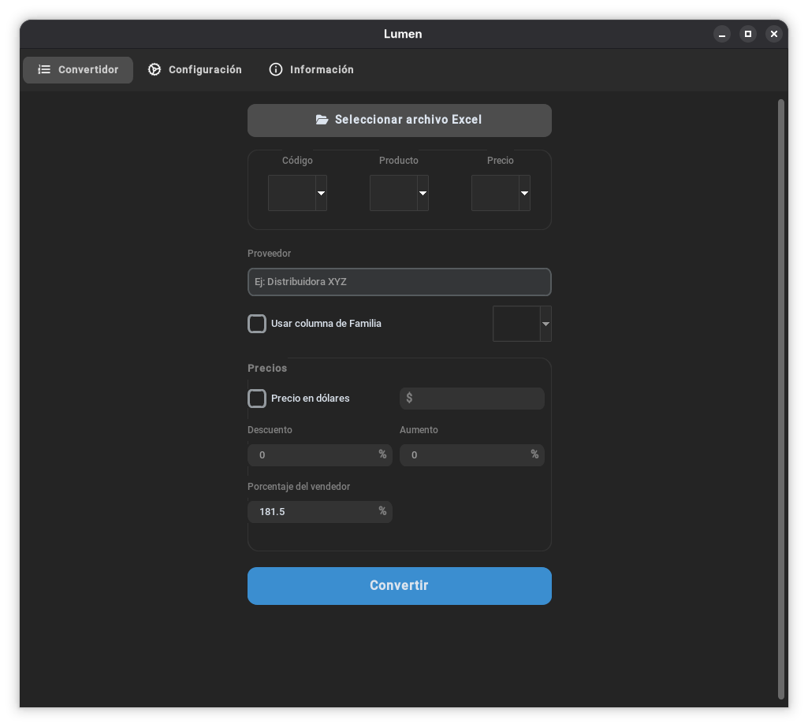
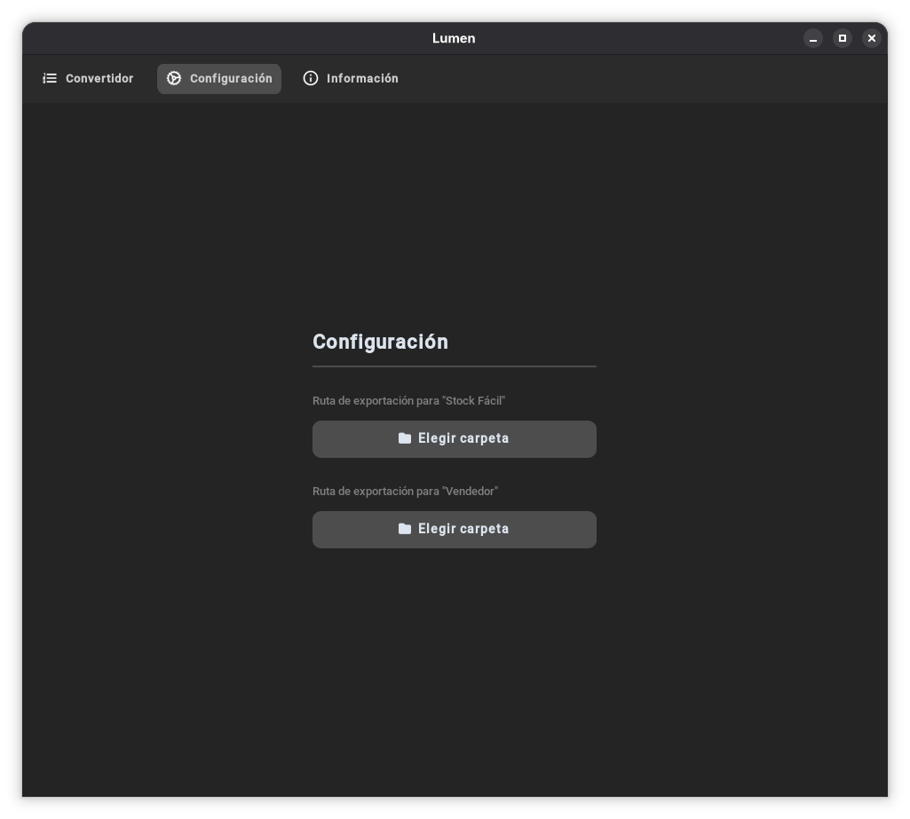
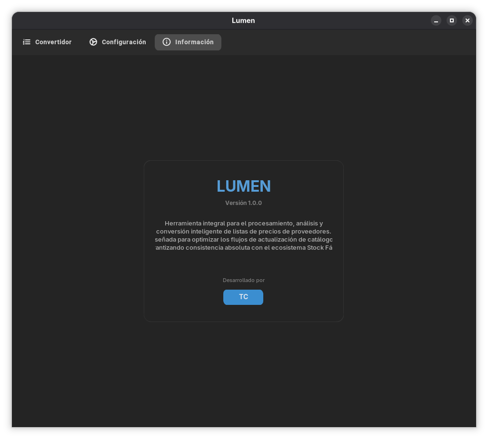

# Lumen

**Versión 1.0.0**

Automatización de escritorio que reemplaza un proceso manual y repetitivo: tomar la lista de precios que manda cada proveedor (en cualquier formato de Excel que traiga) y convertirla a los formatos internos de trabajo. Lo que antes llevaba armar a mano, columna por columna, producto por producto, ahora se hace en segundos.

## Capturas





## Qué hace

Se selecciona el Excel que mandó el proveedor y Lumen se encarga de todo el proceso:

1. **Prepara el archivo**: si es un `.xls` viejo lo convierte, y si tiene columnas con fórmulas (por ejemplo un `BUSCARV`), fuerza el recálculo para asegurarse de leer siempre el valor real.
2. **Detecta las columnas automáticamente**: identifica solo con el contenido en qué columna está el Código, el Producto, el Precio y la Familia, sin importar dónde arranque la tabla dentro del archivo.
3. **Procesa el catálogo completo**: recorre todos los productos, aplicando el descuento, el aumento y el % de vendedor que se configuren, incluso pudiendo dejar todo en dólares con el valor del día.
4. **Exporta a una base de datos general**: además del Excel individual del proveedor, agrega automáticamente una hoja nueva a un Excel "base de datos" anual, donde queda guardada la conversión de cada proveedor procesado a lo largo del tiempo. Con el tiempo, este archivo termina siendo el historial completo de todas las listas de precios convertidas.
5. **Genera la versión para Stock Fácil**: crea, además, el archivo listo para subir directamente a Stock Fácil, con el precio final ya calculado, sin tener que tocar nada a mano.
6. **Valida el resultado**: antes de dar el proceso por terminado, compara el archivo original contra el generado para Stock Fácil, y avisa si algo no coincide.

Todo esto corre en segundo plano con una barra de progreso, así que mientras se procesa un proveedor se puede seguir trabajando sin que la aplicación se congele.

## Estructura del proyecto

```
lumen/
├── functions/
│   ├── config_manager.py
│   ├── exportador.py
│   ├── lector_excel.py
│   ├── preparar_excel.py
│   ├── procesador.py
│   └── validador_stock.py
├── ui/
│   ├── assets/icons/
│   └── views/
│       ├── configuracion.py
│       ├── convertidor.py
│       └── informacion.py
├── app.py
├── main.py
└── requirements.txt
```

## Requisitos

- Windows con Microsoft Excel instalado
- Python 3.10+
- Dependencias en `requirements.txt`

---
Diseñado y programado por **TC**